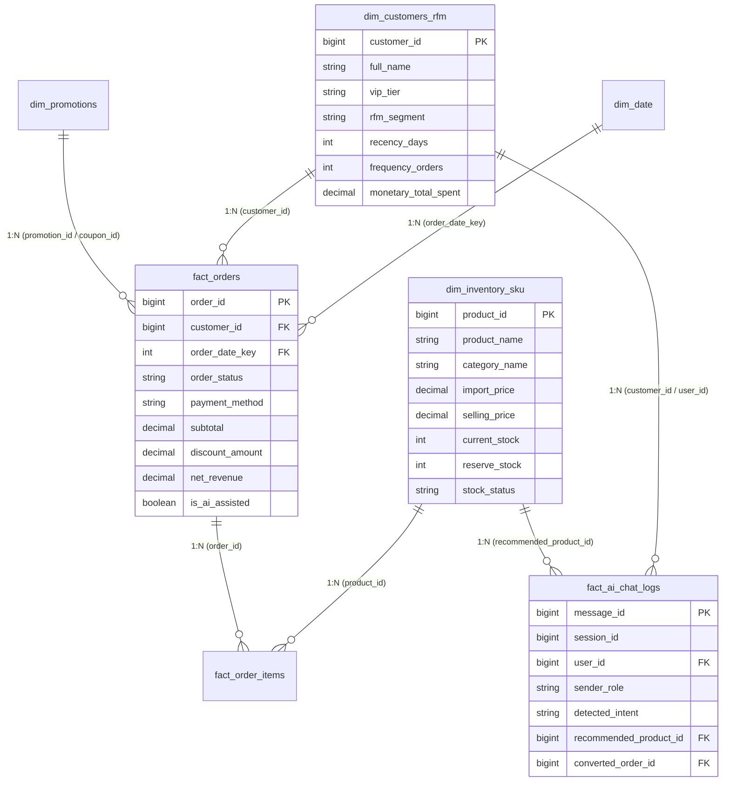

# 📊 Power BI Modeling & DAX Enterprise Calculation Guide
### SmartSale Business Intelligence Data Mart Architecture
**Author:** Senior Data Analyst & Analytics Engineer  
**BI Platform:** Microsoft Power BI / DAX Studio / Fabric  

---

## 1. 🏗️ Kiến Trúc Mô Hình Dữ Liệu (Star Schema Architecture)

Mô hình dữ liệu được thiết kế theo kiến trúc **Star Schema** chuẩn Enterprise, tối ưu hóa tốc độ truy vấn DAX (In-Memory VertiPaq Engine), triệt tiêu hoàn toàn quan hệ đa hướng (bi-directional cross-filtering) không cần thiết và giải quyết triệt để rủi ro Circular Dependency.

### Sơ đồ Quan hệ Thực thể (ERD Diagram):



### Quy tắc Thiết lập Quan hệ trong Power BI:
- **Cardinality:** 1-to-Many (`1:*`) từ các bảng Dimension sang bảng Fact.
- **Cross filter direction:** `Single` (Filters flow from Dimensions to Facts).
- **Date Dimension:** Đánh dấu bảng `dim_date` là *Mark as Date Table* trong Power BI Model View.

---

## 2. 🧮 Danh Mục Đo Lường DAX Chuẩn Doanh Nghiệp (DAX Measures Catalog)

### Nhóm 1: Doanh Thu Cốt Lõi & Đơn Hàng (Core Revenue & Order Metrics)

#### 1.1. Tổng GMV (Gross Merchandise Value)
```dax
Total GMV = 
SUM(fact_orders[subtotal])
```

#### 1.2. Doanh thu thuần (Total Net Revenue)
```dax
Total Net Revenue = 
CALCULATE(
    SUM(fact_orders[net_revenue]),
    fact_orders[order_status] IN {"Completed", "Shipped", "Paid"}
)
```

#### 1.3. Tổng số đơn hàng hoàn tất (Completed Orders Count)
```dax
Completed Orders = 
CALCULATE(
    DISTINCTCOUNT(fact_orders[order_id]),
    fact_orders[order_status] IN {"Completed", "Shipped", "Paid"}
)
```

#### 1.4. Giá trị đơn hàng trung bình (AOV - Average Order Value)
```dax
AOV = 
DIVIDE(
    [Total Net Revenue],
    [Completed Orders],
    0
)
```

---

### Nhóm 2: Phân Khúc Khách Hàng & Quy Luật Pareto (VIP & Loyalty Analytics)

#### 2.1. Doanh thu từ nhóm khách hàng VIP (Gold + Diamond)
```dax
VIP Revenue = 
CALCULATE(
    [Total Net Revenue],
    FILTER(
        dim_customers_rfm,
        dim_customers_rfm[vip_tier] IN {"Gold", "Diamond"}
    )
)
```

#### 2.2. Tỷ trọng đóng góp doanh thu của khách VIP (VIP Revenue Contribution %)
```dax
VIP Revenue Contribution % = 
DIVIDE(
    [VIP Revenue],
    [Total Net Revenue],
    0
)
```

#### 2.3. Tỷ lệ khách hàng mua lại (Repeat Purchase Rate %)
```dax
Repeat Purchase Rate % = 
VAR TotalBuyers = 
    CALCULATE(
        DISTINCTCOUNT(fact_orders[customer_id]),
        fact_orders[order_status] IN {"Completed", "Shipped", "Paid"},
        NOT(ISBLANK(fact_orders[customer_id]))
    )
VAR RepeatBuyers = 
    CALCULATE(
        DISTINCTCOUNT(fact_orders[customer_id]),
        FILTER(
            dim_customers_rfm,
            dim_customers_rfm[frequency_orders] >= 2
        )
    )
RETURN
    DIVIDE(RepeatBuyers, TotalBuyers, 0)
```

---

### Nhóm 3: Sức Khỏe Tồn Kho & Rủi Ro Đứt Gãy Chuỗi Cung Ứng (Inventory Health)

#### 3.1. Tổng giá trị vốn tồn kho hiện tại
```dax
Total Inventory Value = 
SUMX(
    dim_inventory_sku,
    dim_inventory_sku[current_stock] * dim_inventory_sku[import_price]
)
```

#### 3.2. Số lượng SKU vi phạm ngưỡng tồn kho an toàn
```dax
Safety Stock Breached SKUs = 
CALCULATE(
    DISTINCTCOUNT(dim_inventory_sku[product_id]),
    dim_inventory_sku[current_stock] <= dim_inventory_sku[reserve_stock]
)
```

#### 3.3. Chỉ số rủi ro hết hàng khẩn cấp (Stockout Risk Index)
```dax
Stockout Risk Index = 
VAR TotalSKUs = DISTINCTCOUNT(dim_inventory_sku[product_id])
VAR CriticalSKUs = 
    CALCULATE(
        DISTINCTCOUNT(dim_inventory_sku[product_id]),
        dim_inventory_sku[current_stock] <= 10
    )
RETURN
    DIVIDE(CriticalSKUs, TotalSKUs, 0)
```

#### 3.4. Tỷ lệ bán hết danh mục (Sell-Through Rate %)
```dax
Sell-Through Rate % = 
VAR TotalSold = SUM(dim_inventory_sku[units_sold_total])
VAR TotalAvailable = SUM(dim_inventory_sku[current_stock]) + TotalSold
RETURN
    DIVIDE(TotalSold, TotalAvailable, 0)
```

---

### Nhóm 4: Hiệu Quả Thương Mại Hội Thoại AI (Gemini Assistant Commerce Impact)

#### 4.1. Tỷ lệ chuyển đổi Chat-to-Cart (Conversational Funnel)
```dax
AI Chat-to-Cart Conversion % = 
VAR TotalChatSessions = DISTINCTCOUNT(fact_ai_chat_logs[session_id])
VAR ConvertedSessions = 
    CALCULATE(
        DISTINCTCOUNT(fact_ai_chat_logs[session_id]),
        NOT(ISBLANK(fact_ai_chat_logs[converted_order_id]))
    )
RETURN
    DIVIDE(ConvertedSessions, TotalChatSessions, 0)
```

#### 4.2. Mức tăng trưởng giá trị giỏ hàng nhờ AI Chatbot (AOV Lift %)
```dax
AI Assisted AOV Lift % = 
VAR NonChatAOV = 
    CALCULATE(
        [AOV],
        fact_orders[is_ai_assisted] = FALSE()
    )
VAR AIAssistedAOV = 
    CALCULATE(
        [AOV],
        fact_orders[is_ai_assisted] = TRUE()
    )
RETURN
    DIVIDE(AIAssistedAOV - NonChatAOV, NonChatAOV, 0)
```

---

### Nhóm 5: Phân Tích Chuỗi Thời Gian (Time Intelligence)

#### 5.1. Doanh thu lũy kế tháng (Net Revenue MTD)
```dax
Net Revenue MTD = 
TOTALMTD(
    [Total Net Revenue],
    dim_date[full_date]
)
```

#### 5.2. Tăng trưởng doanh thu so với tháng trước (MoM Growth %)
```dax
Revenue MoM Growth % = 
VAR CurrentMonthRev = [Total Net Revenue]
VAR PreviousMonthRev = 
    CALCULATE(
        [Total Net Revenue],
        DATEADD(dim_date[full_date], -1, MONTH)
    )
RETURN
    DIVIDE(CurrentMonthRev - PreviousMonthRev, PreviousMonthRev, 0)
```

---

## 3. 🎨 Hướng Dẫn Thiết Kế Dashboard Layout & Visuals

| Tab Báo Cáo | Loại Visual Đề Xuất | DAX Measures & Dimensions Tương Ứng |
| :--- | :--- | :--- |
| **Executive Overview** | KPI Cards, Line Chart (Revenue MoM), Donut Chart (Payment Method) | `[Total Net Revenue]`, `[AOV]`, `[Completed Orders]`, `dim_date[month_name]` |
| **Customer Segmentation** | Scatter Plot (RFM Recency vs Monetary), 100% Stacked Bar | `[VIP Revenue Contribution %]`, `dim_customers_rfm[rfm_segment]` |
| **Inventory & Supply Chain**| Table Matrix (SKU Alert), Gauge Chart (Stockout Risk) | `[Stockout Risk Index]`, `[Sell-Through Rate %]`, `[Safety Stock Breached SKUs]` |
| **AI Conversational Funnel** | Funnel Chart, Clustered Bar (AOV Comparison) | `[AI Chat-to-Cart Conversion %]`, `[AI Assisted AOV Lift %]` |
